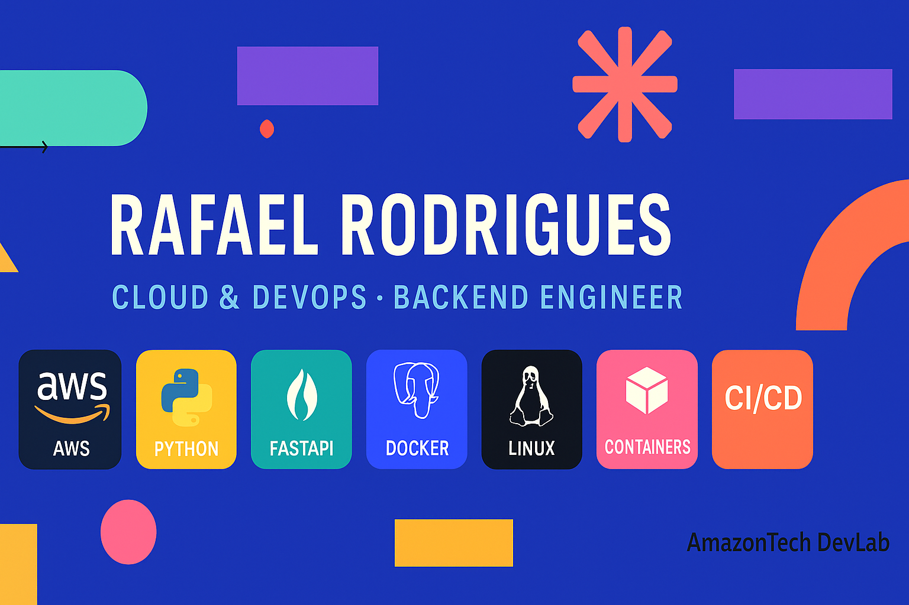

<!-- Banner -->

  

<h1 align="center">🚀 Welcome to My DevOps & Cloud Space</h1>

  <b>CLOUD | DEVOPS | BACKEND | AWS | DOCKER | FASTAPI | AUTOMATION</b>

---

## 👋 Hey there!
Sou **Rafael Rodrigues**, futuro **Cloud/DevOps Engineer** construindo experiência real em deploy, pipelines, automação, containers e backend.

Mantenho o **AmazonTech DevLab** — laboratório próprio com backend **FastAPI + Docker + PostgreSQL + Nginx**, rodando **em AWS EC2 24/7** para estudo prático.

📌 *Não só estudo, construo.*  
💡 *Infra, deploy, erro, troubleshooting e logs fazem parte do jogo.*

---

## 💫 About Me
📍 Belém - Pará 🇧🇷  
🎓 ADS — Análise e Desenvolvimento de Sistemas  
🎯 Cloud | DevOps | Automação | Backend  
⚙ Apaixonado por infraestrutura real, observabilidade e CI/CD

---

## 🔥 What I Do

### ☁ Cloud & DevOps
- AWS EC2 Deploy
- Docker + Docker Compose
- Nginx Reverse Proxy
- PostgreSQL Persistente
- Roadmap → CI/CD, RDS, Observability, K8s

### 🧩 Backend Development
- FastAPI
- JWT Auth
- CRUD Notes
- Swagger Docs organizados

### 🔐 Infra & Segurança
- SG, portas, permissões
- Logs e auditoria básica
- API com autenticação

---

## ⚡ Tech Stack

### ☁ Cloud & Platforms

### 🐳 Containers & Orchestration

### 💻 Backend & API

### 🛠 Infra & Tools

---

## 🔗 Quick Links

| Link | Acesso |
|---|---|
| 🔥 AmazonTech DevLab | https://github.com/amazonroots/amazontech-devlab |
| 🌍 Portfolio | *Em construção* |
| 📄 Resume/CV | *Em breve* |
| 🧪 Repositórios | https://github.com/amazonroots?tab=repositories |

---

## 📂 Featured Projects

| Projeto | Descrição | Status |
|---|---|---|
| **AmazonTech DevLab** | FastAPI + Docker + PostgreSQL + Deploy AWS | 🟢 Online |
| **Sentinel-21** | Firewall cognitivo para LLM | 🧪 Early-Stage |
| **Amazon Roots Website** | Website institucional | 📝 Rascunho |

---

## 📫 Contact Me
📩 **rafael.amazontech@gmail.com**

---

<i>“Cloud se aprende deployando — Infra viva vale mais que 100 aulas.”</i>

