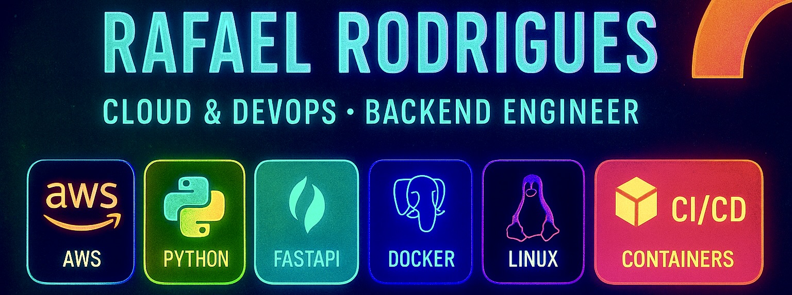

<!-- Banner -->

  

<h1 align="center">🚀 Welcome to the Home of Cloud & DevOps Resources</h1>

  <b>Cloud & DevOps • Backend • AWS • Docker • FastAPI • Linux • CI/CD</b>

---

### Hey there! 👋  
Sou **Rafael Rodrigues**, Cloud & DevOps/Backend Developer.  
Crio ambientes de deploy real, infra automatizada e APIs backend.  
Mantenho o **AmazonTech DevLab**, meu laboratório onde treino Cloud na prática.

> **Infra viva vale mais que 100 tutoriais.**  
> Break → Fix → Deploy → Repeat. ⚙🔥

---

## 💫 About Me

- 🇧🇷 Belém - Pará  
- Estudante de **Análise e Desenvolvimento de Sistemas (ADS)**  
- Foco em **Cloud • DevOps • Backend com Python/FastAPI**  
- Deploy em AWS EC2 com Docker, PostgreSQL, Nginx e JWT  
- Objetivo: **DevOps/Cloud Engineer com automação full-stack**

---

## 🧠 What I Do

### 🌩 Cloud & DevOps
- Deploy completo em EC2 Linux
- Docker & Docker Compose
- Banco persistente com PostgreSQL
- Segurança: SG, portas, permissões e auditoria
- **Próximas etapas:** CI/CD • Observability • Kubernetes • Terraform

### 🧩 Backend Development
- FastAPI • CRUD • Auth JWT • Swagger UI
- APIs REST estruturadas e escaláveis

### 🔐 Infrastructure & Security
- Hardening básico
- Logs & Auditoria de requests

---

## ⚡ Tech Stack

### Cloud & Platforms

### Backend & Languages

### Containers & Orchestration

### System & Automation

---

## 📂 Featured Projects

| Projeto | Descrição | Stack | Status |
|---|---|---|---|
| **AmazonTech DevLab**  🔗 [Repositório](https://github.com/amazonroots/amazontech-devlab)  🔗 [Swagger API Docs](http://3.235.187.206:8005/docs) | Laboratório real em produção na AWS. Backend FastAPI com autenticação JWT, auditoria, Docker + PostgreSQL e deploy 24/7 em EC2. Base para futuro CI/CD, Observability, Terraform/K8s e microserviços. | **FastAPI • Docker • PostgreSQL • AWS EC2 • JWT** | 🟢 Online |
| **AmazonRoots Website (H.P. Lovecraft)**  🔗 [Visitar Site](https://amazonroots.github.io)  🔗 [Repositório](https://github.com/amazonroots/amazonroots.github.io) | Site literário dark inspirado em H.P. Lovecraft & *Re-Animator*. Conteúdo sobre horror cósmico, obras do autor e estética sombria. Web estática escrita em JS/HTML/CSS. | **JavaScript • HTML • CSS • Dark UI** | 🟣 Publicado |
| **Sentinel-21**  🔗 Projeto Conceitual | Conceito de um **Firewall Cognitivo para IA**, criando camada de segurança entre usuário ↔ modelo. Futuro: detecção de prompt malicioso, reescrita segura e log de auditoria. | **Research • Cyber/AI Security • Architecture** | 🧪 Em estudo |

---

## 🗺 AmazonTech DevLab Roadmap

- [x] Deploy FastAPI + Docker + PostgreSQL na AWS  
- [x] Autenticação JWT + Auditoria  
- [ ] CI/CD Pipeline  
- [ ] Observability (Grafana/Prometheus)  
- [ ] Terraform • Kubernetes  
- [ ] Módulos de automação IA/Cloud  

---

## 🧩 Links Rápidos

| Acesso |
|---|
| 🔥 **AmazonTech DevLab** — Backend em produção |
| 🌍 **AmazonRoots Website** — Lovecraft Dark Project |
| 🧪 **Sentinel-21** — Firewall de IA (conceito) |

---

## 📫 Contact

📩 **rafael.amazontech@gmail.com**

> _"Build. Break. Fix. Deploy. Repeat."_ ⚙🔥

---
