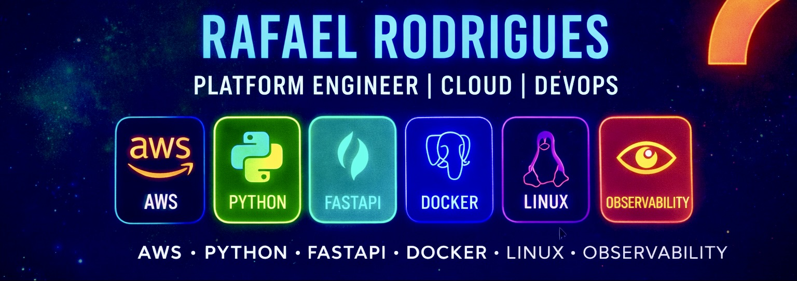

<!-- Banner -->

  

<h1 align="center">Rafael Rodrigues</h1>

  <b>Platform Engineer | Cloud | DevOps</b>

  AWS • Python • FastAPI • Docker • Linux • CI/CD • Observability

---

## About Me

Sou **Rafael Rodrigues**, profissional com foco em **Platform Engineering, Cloud, DevOps e Observabilidade**.

Construo projetos com estrutura de ambiente real, unindo deploy em cloud, containers, integração contínua, monitoramento de serviços e backend funcional para operação de aplicações.

Meu trabalho está voltado para soluções técnicas que demonstrem capacidade prática de automação, visibilidade, confiabilidade e evolução de serviços.

> **Infra viva vale mais que 100 tutoriais.**  
> **Build → Break → Fix → Deploy → Repeat.**

---

## Core Strengths

- Platform Engineering mindset
- Cloud & DevOps workflow
- Docker-based environments
- CI/CD automation with GitHub Actions
- FastAPI-based backend systems
- Monitoring and service visibility
- Linux-based deployment and operation

---

## Tech Stack

  
  
  
  
  
  
  

---

## Featured Projects

| Projeto | Descrição | Stack | Status |
|---|---|---|---|
| **API Sentinel Web**  🔗 [Repositório](https://github.com/amazonroots/api-sentinel-web) | Plataforma web leve de monitoramento de APIs com dashboard, cadastro de endpoints, checagens reais, testes automatizados e CI com GitHub Actions. | **FastAPI • SQLModel • SQLite • Jinja2 • Docker • Pytest • GitHub Actions** | 🟢 Ativo |
| **AmazonTech DevLab**  🔗 [Repositório](https://github.com/amazonroots/amazontech-devlab)  🔗 [Swagger API Docs](http://100.26.73.245:8005/docs) | Projeto prático voltado para deploy real, backend, automação e operação em cloud. | **FastAPI • Docker • PostgreSQL • AWS EC2 • JWT • CI/CD** | 🟢 Online |
| **AmazonRoots Website**  🔗 [Visitar Site](https://amazonroots.github.io)  🔗 [Repositório](https://github.com/amazonroots/amazonroots.github.io) | Site autoral com identidade visual dark. | **HTML • CSS • JavaScript** | 🟣 Publicado |
| **Sentinel-21** | Conceito de segurança para ecossistemas de IA. | **Research • AI Safety • Security Concepts** | 🧪 Em estudo |

---

## Contact

📩 **rafael.amazontech@gmail.com**  
🔗 **LinkedIn:** https://www.linkedin.com/in/rafael-rodrigues-916258399

---

  <b>Build. Break. Fix. Deploy. Repeat.</b>

